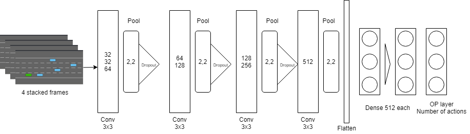
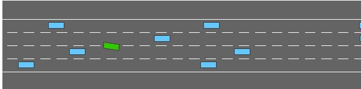
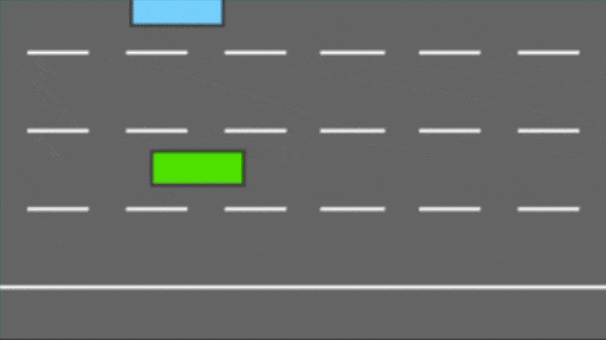
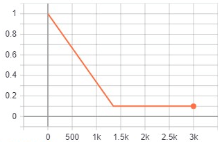
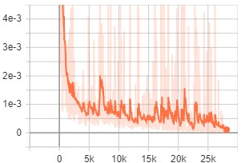
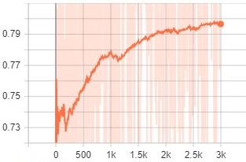

# Double DQN Reinforcement Learning for Vehicle Overtake using CNNs

This Repo contains code and instructions for implementing Double DQN Reinforcemnt Learning in an OpenAI Gym like environment. It takes image as the input and the action space as the output for the network. 

***Idea:** The main idea is to learn how to do an overtaking action using Double DQN RL in a top-down view highway environment.
Since this project uses an OpenAI Gym like format, it will be easy for anyone to modify this project their gym like environment within seconds.*

## Requirements
* Python 3.7
* Tensorflow 2.3.0
* Numpy
* OpenCV
* Your OpenAI-Gym like Environment
* In this case [Highway Environment](https://github.com/eleurent/highway-env)

## Deep Reinforcement Learning

## Double DQN

## The need of Double DQN

## Network Architecture

 

## 

## Clone this Repository:  

    git clone https://github.com/perseus784/rl_overtake.git

Download [this google drive folder](https://drive.google.com/drive/folders/1_p5Pcj7jhFgoOf-L-QueEpoTMoTW-C34?usp=sharing) and put the *training* folder inside the files folder.

## To test:
Open command prompt on folder rl_overtake and do *python [trail_run.py](https://github.com/perseus784/rl_overtake/blob/master/trail_run.py)* and you can see the agent running in the highway environment after loading the restored model. [Demo](https://youtu.be/sH00TWLwBoA)

 

## To run the training:  

      python run.py
This will start the training but make sure that you delete the previous training data like models, tensorboard, plotting csvs from the logs folders. See [here](https://youtu.be/akqh1cmFD-k) for how to run.

## Implementation

### Application

Our goal is to help the user car overtake the bot cars on its own in a roadway environment. We train the user car with the help of deep reinforcement learning[3], the reward function will penalise the user car every time it slows down, every time it crashes into bot car and if there are any bot cars in front of it. The reward function will reward the user car whenever it overtakes a bot car. Since we use the raw pixels from the environment as our state space, we can easily easily change the environment and the reward function to adapt to a new problem.

With the help of the reward function, our program will keep iterating and teach the user car what to do when there are cars ahead of it, in our case the user car will overtake the bot cars. Our application will also show the roadway environment and the cars with help of an OpenAI 2D framework and it will look like the figure below.

### Dataset
We are using online learning, so we do not need any dataset to train our model. The dataset becomes available in a sequential manner and if the data is rewarded positively then we use the same dataset to update the future best predictor at each step. The dataset is created and it is used as a predictor based on the reward points earned by the dataset. If the rewards are negatively affected by the data then we chuck the data and vice versa.
 \begin{figure}[htp]
    \centering
    \includegraphics[width=8cm]{figures/image3.png}
    \caption{Our Environment}
    \label{fig:environment}
\end{figure}

### Reward Function
The reward function is one of the most important aspects of reinforcement learning because this is what defines what the agent should learn using the network. So, in our task the reward function is basically designed for overtaking. This means the agent is greedy about any vehicle before it. In the lane if any vehicle is before it, the the ego vehicle tries to overtake it. It is rewarded for being on top and also it is negatively rewarded if it makes an collision. Additionally, we also reward it for staying on the right most lane. This makes the agent learn to stay on a favourite lane.

### Command to install
\begin{itemize}
    \item Highway Environment: pip install --user
    \item git+https: github.com/eleurent/highway-env
    \item Python: https://www.python.org/downloads/
    \item Tensorflow: pip3 install --user tensorflow-gpu
\end{itemize}

The Highway Environment can be imported and used like below,
 \begin{figure}[htp]
    \centering
    \includegraphics[width=8cm]{figures/image8.png}
    \caption{OpenAI gym like Usage}
    \label{fig:openAI}
\end{figure}

## Training

Our network consists of two main parts, which is the training network and the predicting network. As we have discussed in the double deep Q learning section, these are our two estimators. The pseudo code of our implementation can seen below.

The figure below shows how the overview of our network would be, the training network will train on the data and gather the best parameters for the model. These parameters are then sent to the predicting network, which will execute these actions on the state and then send the results back to the training network. The training network will further use this data to tweak its parameters and train again. By doing this operation of leveling up, we teach the agent how to overtake depending on the state and the actions.

### Experience Replay

As the agent learns and traverses through the episodes, it forgets the previously learned experiences. So, when we train it is important to recursively remind the network of what it learnt and the way to do that is is using a experience replay mechanism. This mechanism helps the network remember it's experience by randomly picking from these while training.

The program basically stores a data structure with the current observation, action taken, the next state and the rewards it got. Also, we don't want to store the entire history so we have a buffer memory size of 15000 such data structures. The buffer memory is basically a queue with a fixed size of 15000 and it pops out the old memories as it accumulates more. The network uses this memory pool to select it's batches and train on it.

### Exploration Vs Exploitation

The agent when trained from the first overfits the experience and does not explore new options for getting more rewards. In order to overcome this problem of getting stuck at rigid state, we can use a value called $\epsilon$ to determine whether to explore a random action from the action space or to use the agent input for making an action. But we also cannot let the randomness to affect our agent's ability to learn. The epsilon value value decides between exploration or exploitation mode of the agent and it is reduced over time. This is done for the first half of the training i.e. in our case, we reduced the epsilon value from 1 to 0.1 over a period of 1500 episodes out of 3000 episodes as shown in the figure[\ref{fig:epsilon}] above.

### Hyperparameter Tuning
The usual Neural Network training involves a good amount of hyperparameter tuning but those were a little bit more streamlined and made easy over the years. Thanks to the efforts of people over years in deep learning community for their findings. But the process gets more complicated with Deep RL especially with $\epsilon$, learning rate and batch size tuning. This was very complex because everything mattered and even a small change in these parameters caused huge differences over time. 

    * Epsilon(Exploration vs Exploitation) value was tried with different decay values and over a different period of time like not decaying till the first half the training and then decay over last half, decay within the first third of the episodes, no exploration etc. But what worked for us was slowly reducing the epsilon over the first half of the training.
    * Learning Rate on the other hand we went with the default tensorflow Adam learning Rate but it was causing us more fluctuations in the loss during the training so went with a reduced 1e-4 learning rate for our training network. This helped reducing the fluctuating loss.
    * We used a batch size of 32 for the final training. Initially, we went with the higher batch size such as 256, 512 but those did not show improvements and also it occasionally caused memory exhaust errors. 
    * Also, training frequency is also a major factor in this. Training frequency is basically how many times the target network should be trained over an interval. We trained the network once every agent makes four steps in the environment. This gave enough train interval for the network as well collect the data.
    * The other factor is how often we update the online or predicting network for transferring the experience. This was done for every 10 episodes so that the network predictions was made better over time and also not too much of updating the online network to cause too much instability in the predictions.

## Results

We built a double deep Q learning network and ran the network on the highway environment. After reiterating for multiple times to get the hyperparamters right, we finally got aversion which worked. We can see the loss and reward graphs of our network below. 

### Metrics
To judge the the performance of our network, accuracy cannot be taken into consideration. As the network might be able to accurately predict the data but, might not have learnt the data properly. This is why in our case we judge the network's performance on the basis of loss and how the rewards were calculated. 

### Loss

The loss graph will show that the network is learning better after each epoch as it shows the overall the network is making better decisions. The loss graph is drawn for the training network. The loss graph is much smoother after we reduced the learning rate to a very small value and we have also smoothend the loss value using Tensorboard. The following graph is what we got for the final iteration of our implementation. 

### Reward Graph

The rewards graph will show that as the epochs keep increasing the rewards will also increase because as the network learns more, it will perform actions which gives it the maximum reward. The original paper where they developed the Double DQN technique, the authors ran the environment for 250M epochs compared to us, we only ran the training for 250K times.

As we have mentioned above, the accuracy graph is not a good measure of how well our network performs in a reinforcement learning task but, as you can see in the loss graph, the loss decreases with each epoch which suggests that the network is learning properly. 

\subsection{Links}
We have created seperate external links for each of the things below,

\begin{itemize}
    \item Demo: \url{https://youtu.be/sH00TWLwBoA}
    \item How to Run: \url{https://youtu.be/akqh1cmFD-k}
    \item Project: \url{https://github.com/perseus784/rl_overtake} (This is a private repository, please request for access if you need to access it)
    \item Trained models and Tensorboard metrics can be found in this drive folder: \url{https://drive.google.com/drive/folders/1_p5Pcj7jhFgoOf-L-QueEpoTMoTW-C34?usp=sharing}
\end{itemize}
You can use these external links to see the performance of the model in real time application. Specific instruction on how to run the code for training or testing is given the readme file attached below after the code.

\section{Discussion and Conclusion}

As discussed in the sections above, our network is performing well in terms of learning using the CNN architecture. The results in the videos and the graphs really shows that the agent was able to learn the given task and perform well. Of course, the network is agent is not perfect because of limited training cycles and rewards modelling. We also can observe that our agent performs better on the right lane and causes more accidents when it is on the left most lane. We could even make a complicated reward function for edge cases and that might drastically improve the performance of the agent. But we see this as good beginning to a more generalized AI approach. This is because instead of using the state data, we are using the raw images rendered by the environment and then sending it to our network. The advantage of using raw images over the state data is that if we needed to change the problem for example, in a highway environment with more lanes or with more agents, we would not need to change our network architecture at all , we would just have to change our input and the network will adapt to the new environment. 

 \begin{figure}[H]
    \centering
    \includegraphics[width=8cm, height=6cm]{figures/image12.png}
    \caption{Top-View based training}
    \label{fig:topdown}
\end{figure}

When we initially thought about doing this project, we questioned ourselves that whether it will be useful or just a gimmick. But we found that the many of the industry leading self-driving researches use this Top View approach to learn control mechanisms for their vehicle agents. This includes google, Tesla, Uber and more. As you can see in the image above [\ref{fig:topdown}], this is what is used in training state of the art control agents for modern self-driving research and it really cleared us to pursue this project.

The main reason to do this project was to learn multiple aspects of Neural Network performance and to experiment with creating generalized agents which can perform on any task with minimal modifications. We think we were able to achieve that goal by creating a CNN based agent which can just learn task just by feeding in raw pixels. 
Overall the project gave us a good knowledge about Network architecture selection, hyperparameter tuning, reward function designing, Experience Replay, Exploration Vs Exploitation mechanisms and Double Deep Q learning. With this we can further extend this project to much more advanced techniques such as A2C or DDPG for continous space learning.

## Loss and Rewards:

The program basically stores a data structure with the current observation, action taken, the next state and the rewards it got. Also, we don't want to store the entire history so we have a buffer memory size of 15000 such data structures. The buffer memory is basically a queue with a fixed size of 15000 and it pops out the old memories as it accumulates more. The network uses this memory pool to select it's batches and train on it.

