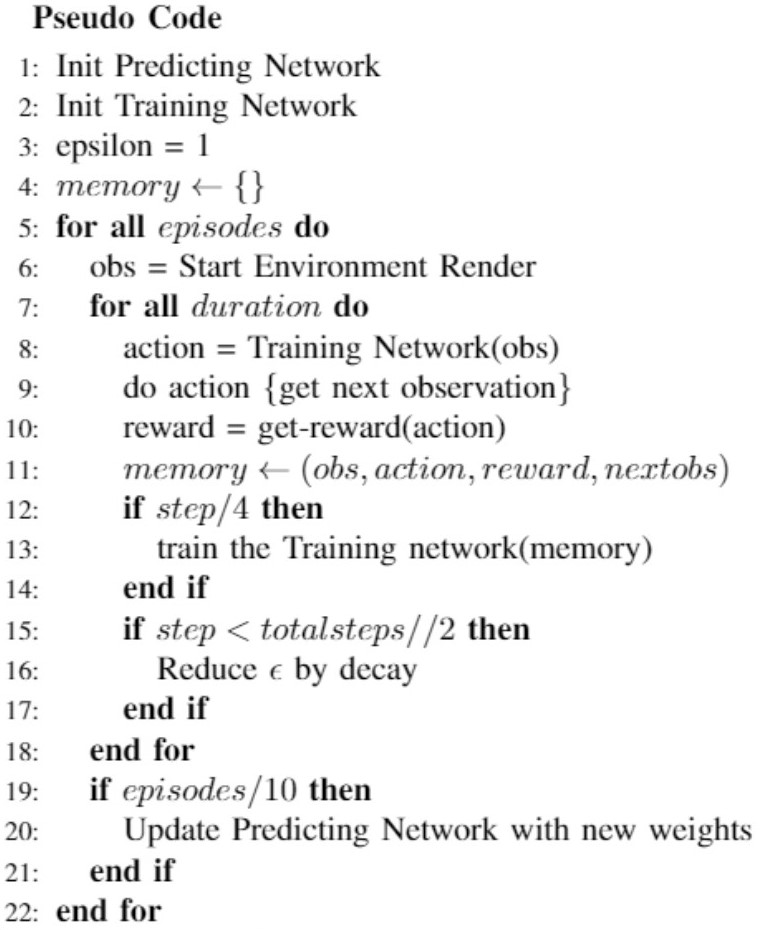

# Double DQN RL for Vehicle Overtake using CNNs

This Repo contains code and instructions for implementing Double DQN Reinforcemnt Learning in an OpenAI Gym like environment. It takes image as the input and the action space as the output for the network. 

***Idea:** The main idea is to learn how to do an overtaking action using Double DQN RL in a top-down view highway environment.
Since this project uses an OpenAI Gym like format, it will be easy for anyone to modify this project their gym like environment within seconds.*

## Prerequisites
* Python
* Reinforcement Learning
* Deep Q Learning and DQNs
* A little bit of Tensorflow

## Requirements
* Python 3.7
* Tensorflow 2.3.0
* Numpy
* OpenCV
* Your OpenAI-Gym like Environment
* In this case, get [Highway Environment](https://github.com/eleurent/highway-env)

## Deep Reinforcement Learning
As mentioned earlier, the repo assumes you have atleast beginner level knowledge to Deep RL. if not, please go through [this](https://github.com/perseus784/SaturnMind) for deep RL and [this](https://medium.com/@ipaar3/saturnmind-94586f0d0158) for reinforcement learning with easy examples. 
We have to use a Neural Network instead of a Q table incase of Deep Q learning. As we know, RL is an online training algorithm and does not require a dataset and generates it's own samples on the go.

## Model Architecture
We all know the effectiveness of CNNs when it comes to image based data. So, I made a CNN with the following architecture. I have experimented with various configurations and found this most suited for the application. Added two hidden layers to understand the task and give the respective output action to the agent. Now we can just train the network and get some good outputs but there are problems with this approach discussed in next section.

## Double DQN

  

To summarize, Double DQN employes two networks. Let's say, one is the training network and another as the predicting network. Predicting network plays the game and gains experience to store with it's knowledge level, the training network uses the stored experiences to train the network in a regular interval. Every certain period, the trained network transfers it's knowledge to the predicting network.   

This way, the learning is more stable as the agent levels up linearly, do not fluctuate or make random mistakes. If there is only one network, the learning and playing takes place using the same network which might make a particular action overvalued. This is called the maximization bias which results in overestimation of a particular action but using Double DQN overcomes this by using two networks.
Please refer here for a comprehensive explanation on Double DQN and why it is needed. 

## Training

Our network consists of two main parts, which is the training network and the predicting network. As we have discussed in the double deep Q learning section, these are our two estimators. The pseudo code of our implementation can seen below.

The training network will train on the data and gather the best parameters for the model. These parameters are then sent to the predicting network, which will execute these actions on the state and then send the results back to the training network. The training network will further use this data to tweak its parameters and train again. By doing this operation of leveling up, we teach the agent how to overtake depending on the state and the actions. Two main parameters are tracked here:

### Loss

The loss graph will show that the network is learning better after each epoch as it shows the overall the network is making better decisions. The loss graph is drawn for the training network. The loss graph is much smoother after we reduced the learning rate to a very small value and we have also smoothend the loss value using Tensorboard. The following graph is what we got for the final iteration of our implementation. 

### Reward Graph

The rewards graph will show that as the epochs keep increasing the rewards will also increase because as the network learns more, it will perform actions which gives it the maximum reward. The original paper where they developed the Double DQN technique, the authors ran the environment for 250M epochs compared to us, we only ran the training for 250K times.

As we have mentioned above, the accuracy graph is not a good measure of how well our network performs in a reinforcement learning task but, as you can see in the loss graph, the loss decreases with each epoch which suggests that the network is learning properly. 

## How to Run 
*  Clone this Repository:  
        git clone https://github.com/perseus784/Vehicle_Overtake_Double_DQN.git

*  Download [this](https://drive.google.com/drive/folders/1_p5Pcj7jhFgoOf-L-QueEpoTMoTW-C34?usp=sharing) google drive folder and put the *training* folder inside the files folder.

*  python run.py
     
This will start the training but make sure that you delete the previous training data like models, tensorboard, plotting csvs from the logs folders. See [here](https://youtu.be/akqh1cmFD-k) for how to run. 

### To test:
Open command prompt on folder root folder and do *python [trail_run.py](https://github.com/perseus784/rl_overtake/blob/master/trail_run.py)* and you can see the agent running in the highway environment after loading the restored model. [Demo](https://youtu.be/sH00TWLwBoA)

## Results

We built a double deep Q learning network and ran the network on the highway environment. After reiterating for multiple times to get the hyperparamters right, we finally got a version which worked. We can see our agent in action below. Ofcourse, the agent is not perfect because the training is just run for 250k iterations while the standard was to run for 250M iterations. But still we can see the network is able to learn and perform well in most conditions.

 

